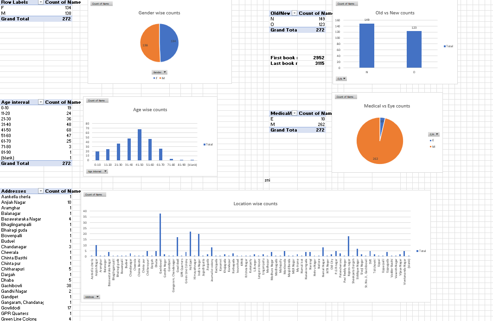

# Electronic Health Records System

Other Documents:
[Excalidraw](https://excalidraw.com/#room=78b7c7295ab427c5ccb4,aMb_CL0ob6Uv83EtUup8Iw)

## Medical camp details

### Patient Physical Experience

#### Step 1: Registration

A patient arrives in waiting room. First time visitors give their personal details name, age, gender, address. They will be assigned with a booklet with an unique code along with an entry token number. (Patient demographics: Name, address, age, gender, and other identifying information)

Current regirtration form columns: ID_no,Name,Gender,Age,Address,Contact_No,Eye/Medical(Excepected values E , E/M, M))

#### Step 2: Medical history

Past and current medical conditions, allergies, medications, surgeries, hospitalizations, and immunizations.

#### Step 3: Vital signs

Height, wieght, Blood pressure, Blood Sugar level, Anemia test, Imaging results: X-rays, CT scans, MRI scans, and other medical images.

#### Step 3 Medical history
Past and current medical conditions, allergies, medications, surgeries, hospitalizations, and immunizations.

#### Step 4: Doctor Visit

Based on patient symptoms doctor prescribe medication or suggests any tests if needed.

- Test results: X-rays, CT scans, MRI scans, and other medical images.
- Clinical notes: Progress notes, physician orders, diagnostic test results.

#### Step 5: Medicine Distribution

- Medicine inventory
- Medicine dispatching
- Counselling

#### Step 6: Opticals management

- Eye test
- Opticals inventory
- Opticals dispatching

## Project Requirements­

## Reports  generation  and  its automation

- Need to Autoamate the reports 
- Following is the report structure 

        

## Reporitng  elements

    Gender wise counts
        Simple Gender (male and female) wise patient counts to be displayed.
    
    Age interval wise counts 
        Simple age wise patient counts to be displayed.
    
    Area wise counts
        Simple locations wise patients counts to be displayed.
    
    Doctor wise counts 
        No of patients a doctor has attend counts to be displayed.
    
    New vs Old bifurcation 
        Count of new(new registered patients on that day) and old (old patients who attended at least any one of the previous medical camp)
    
    Eye , Medical and both counts 
        Count of patients who took medical prescription and count of patients who only visit for eye treatment.
    
    Token vs registrations counts
        Tokens distributed vs total patients attended the camp(the one who completed registration on that day.)
    
    Patient sugar level interval wise counts
        Track of patients sugar level over the time. Count of patients of particular sugar level interval to their current sugar level interval.

    Patient consistancy report
        Number of patients who attended number of camps.
    
    Real time counts while the camp is been conducted
        Real time counts of patients completed ther check up process.
        Real time counts of patients attended by each doctor.

    First and last Id nos. for that camp
        First and last id number of book to be shared to CCC team.

### Problems to solve

- Observe patient health over time : To check whether patient health has been improved over time, if they have missed any medical camp, missing medication or improper diet or any other factors.

- Solve book keeping problem for the patient : Link to patient basic info, medical history, medical notes and suggestion by doctors, medications prescribed, any tests reports if needed. Unique to every patient.

- Track missing visits & follow ups – Once medical camp is completed, generate list of missing patients, contact and followup on the reason.

- Medicine Inventory Management – For better procurement, stock management & distribution

- Map people & locality

- Send alerts for follow up visits & when test reports are ready

- Attach test results pdf to patient's health record

- Record patient feedback

- Add checks in system to reduce data mismatch between patients – Combination of Mobile number along with name [This is a specific suggestion, should be discussed in the features specifics and requirement.]

- Display the list of diagnostic centres available within the patients area which makes it easier for them to reachout. [This does belong here. Add it to miscellaneous ideas.]

## Epics

- Appointment management
  - Dashboards
    - Registrarion Queue dashboard
  - Patient registration
- Health profile management
  - Record patient vitals
  - Doctor prescription details
    - Diagnosis and Medicine
  - Test Results SS/PDF
  - Dashboard
    - Patient Health profile dashboard
- Inventory
  - Medicines
  - Equipments

## Personas

- Doctor
- Volunteer
- Admin
- Patient

---

### Doctor

- Doctor need to access the patient basic information, medical history.

  - (previous reports if any)

- Gather present symptoms, provide diagnosis, and suggest medications/tests.

- Doctor Notes ( precautions and preventive measures shared to the patient ).

- Update the Doctor details [ CRUD ] [ - soft delete ]

### Patient

- Update the patient details [ CRUD ] [ - soft delete ]

- Upload all the medical history.

- Get new book with all the past medical record

- Track my attendance of medical camp

- Need to remind me of upcoming camp

- Inform me when my reports are generated

- How can I share my medical history, medications to other doctors (faq)

- Patient [ FirstName, MiddleName, LastName, age, gender, mobile number, dateOfBirth, address, Pincode , unique book id is noted for post resgitration ] (can we register them during canvasssing itself ?)

- History [ unique book id, date of enrollment, basic vitals-bp, pulse, weight, height, tests, medicines, temperature ]

### Volunteer

- Help patients with registration
- Help patients with Tokens
- Capturing Vitals
- Maintaining patient data for particular doctor
- Recording the medicines handed over to the patient according to the prescription
- Take feedback

### Admin

- Access management
- Capture the number of patients in a camp with the help of tokens
- Final medicine statistics for better procurement, stock management
- Capturing volunteers data
- Basic analytic info from the data in hand to prepare for next medical camp
